# Flamelet-Based Combustion Modeling using Machine Learning

## Introduction

This project replaces traditional combustion table lookups (Flamelet-Generated Manifolds, FGM) with machine learning surrogates. The goal is to predict the **source term of the progress variable, log(ω̇<sub>C</sub>)**, directly from a small set of physical inputs, avoiding the need to interpolate large pre-tabulated flamelet libraries during a combustion simulation.

We generate our own flamelet data with **Cantera**, turn it into a supervised regression dataset, and train/compare four regressors:
- Feedforward Neural Networks (**ANN1** — shallow baseline, **ANN2** — deeper)
- **Random Forest** (RF)
- **Gradient Boosted Trees** (GBT)

All models are evaluated with the same metrics (RMSE, R², MAAPE, tolerance accuracy) and visualized across the Z–C combustion space so their errors can be compared spatially, not just numerically.

---

## How the Data is Generated

Flamelet data comes from **counterflow diffusion flames** solved in Cantera (`dataset_generation/generate_flamelets.py`), using the GRI-Mech 3.0 mechanism with CH₄ as fuel and O₂/N₂ as oxidizer. Each flamelet is parameterized by:

- **Inlet temperature** (T<sub>inlet</sub>)
- **Pressure** (P)
- **Mass flux** (ṁ, `mdot`)

`generate_flamelet_batch.py` sweeps a grid of 5 temperatures × 4 pressures × 10 mass fluxes (200 combinations) and calls `generate_flamelet()` for each, saving the raw solved flame state (`z`, `T`, species mass fractions) as `.npz` files named after their operating conditions, e.g. `flamelet_T800_P10_M50.npz`.

**Preprocessing** (`dataset_generation/preprocess_data_batch.py`) turns each raw flamelet into training rows:
1. Computes the **progress variable C** as a weighted sum of CO, CO₂, H₂O, and OH mass fractions.
2. Computes **ω̇<sub>C</sub>** as the gradient of C along the flamelet grid, clips it to avoid `log(0)`, and takes `log10` of it — this is the regression **target** (`log_omega_C`).
3. Uses Cantera to look up thermophysical properties (**Cp**, viscosity **μ**, thermal conductivity **κ**) at each grid point.
4. Parses `T_inlet`, `P_bar`, `mdot` back out of the filename and attaches them as extra columns.

All flamelets are concatenated into a single table: **`data/processed/big_dataset.csv`**, with feature columns `Z, C, T_inlet, P_bar, mdot` and target `log_omega_C`. (`preprocess_data.py` / `generate_flamelets1.py` are the single-flamelet versions of the same pipeline, useful for a quick smoke test before running the full batch.)

`data/raw/` (the intermediate `.npz` files) is git-ignored — only the final processed CSV is committed.

---

## Models (`model_code/`)

All four models share the same preprocessing: features and target are standardized with `StandardScaler`, and the data is split **70% train / 15% validation / 15% test** (`data_loader.py` for the ANNs, an equivalent `train_test_split` for the tree models). A fixed seed (`utils.set_seed`) keeps runs reproducible.

| Script | Model | Notes |
|---|---|---|
| `ann1.py` | ANN1 | `5 → 64 → 32 → 1` MLP, ReLU, MSE loss, Adam, 100 epochs — shallow baseline |
| `ann2.py` | ANN2 | `5 → 128 → 64 → 32 → 16 → 1` MLP, same training setup — more capacity |
| `rf.py` | Random Forest | `RandomForestRegressor`, 100 trees |
| `gbt.py` | Gradient Boosted Trees | `GradientBoostingRegressor`, 300 estimators, lr=0.05, max_depth=6 |

Shared helpers:
- `evaluate.py` — computes RMSE, R², MAAPE, and accuracy within a tolerance (default `|Δ| ≤ 0.1`), and prints/returns them as a dict.
- `plots.py` — saves training curves, predicted-vs-true scatter plots, and Z–C heatmaps (true / predicted / error / AAPE) from each model's saved predictions.
- Each training script writes its validation/test metrics to `results/graph/<model>/<model>_metrics.json` and raw predictions to `<model>_raw.npz`, so plots and comparisons can be regenerated later without retraining.

---

## Running the Project

### 1. Environment Setup

A dedicated `conda` environment keeps Cantera, PyTorch, and scikit-learn versions compatible.

```bash
conda env create -f environment.yml
conda activate ml-fgm-env
```

### 2. Generate Flamelet Data

**a) Single flamelet (quick check):**
```bash
python3 dataset_generation/generate_flamelets1.py
python3 dataset_generation/preprocess_data.py
```

**b) Full batch — 200 flamelets across the T/P/ṁ grid (takes a while):**
```bash
python3 dataset_generation/generate_flamelet_batch.py
python3 dataset_generation/preprocess_data_batch.py
```
This produces `data/processed/big_dataset.csv`, the dataset all models train on.

### 3. Train the Models

```bash
python3 model_code/ann1.py   # Small ANN
python3 model_code/ann2.py   # Deeper ANN
python3 model_code/rf.py     # Random Forest
python3 model_code/gbt.py    # Gradient Boosted Trees
```

### 4. Visualize Results

```bash
python3 model_code/ann_plots.py    # ANN loss curves, pred-vs-true, Z-C heatmaps
python3 model_code/tree_plots.py   # RF + GBT AAPE heatmaps
python3 model_code/compare.py      # Bar-chart comparison across all 4 models (load-only, no retraining)
```
All plots are saved under `results/graph/`.

---

## Results

### ANN1: Baseline Neural Network

ANN1 is a lightweight feedforward network serving as a baseline for predicting log(ω̇<sub>C</sub>): `Input (5) → Linear(64) → ReLU → Linear(32) → ReLU → Linear(1)`, trained with MSE loss and Adam over 100 epochs.

**Performance:**
| Split       | RMSE    | R²      | MAAPE   |
|-------------|---------|---------|---------|
| Validation  | 0.8783  | 0.9807  | 0.1215  |
| Test        | 0.8978  | 0.9799  | 0.1233  |

| **Graph** | **Inference** |
|-----------|---------------|
| **Training Curve**<br>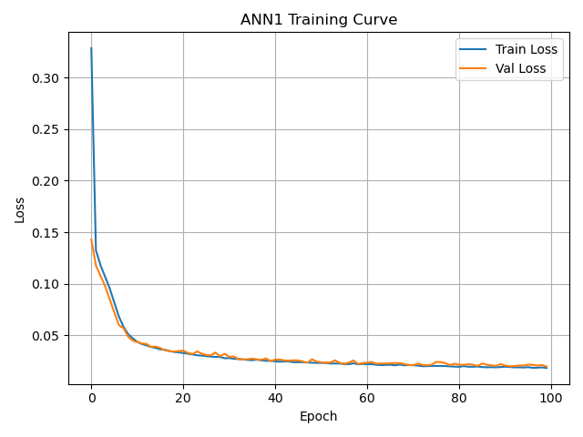 | <ul><li>Training and validation losses decrease rapidly and stabilize by ~30 epochs.</li><li>Both curves track closely, suggesting <strong>no overfitting</strong>.</li><li>Final loss values are very low, confirming <strong>effective learning and generalization</strong>.</li></ul> |
| **Predictions vs Ground Truth**<br>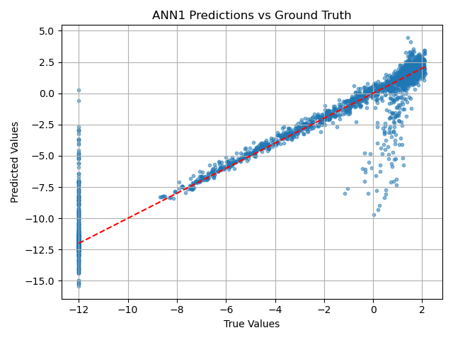 | <ul><li>Strong alignment along the diagonal line indicates <strong>high prediction accuracy</strong>.</li><li>Most values tightly cluster around the ideal line, confirming <strong>strong R² (≈0.98)</strong>.</li><li>Slight deviation at extreme values (e.g., low end saturation) points to <strong>minor edge-case errors</strong>.</li></ul> |
| **True log(ω̇C) Map**<br> | <ul><li>Smooth and physically plausible distribution over the Z–C domain.</li><li>Clearly reveals regions of high and low \( \dot{\omega}_C \), providing a <strong>solid reference for model predictions</strong>.</li></ul> |
| **Predicted log(ω̇C) Map**<br>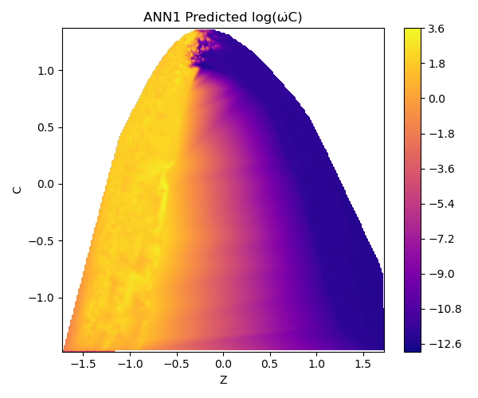 | <ul><li>Accurately captures overall structure seen in the true map.</li><li>Smooth gradients imply <strong>good generalization</strong> over continuous space.</li><li>Minor sharp features may reflect <strong>limited learning near sparse or steep regions</strong>.</li></ul> |
| **Prediction Error Map**<br>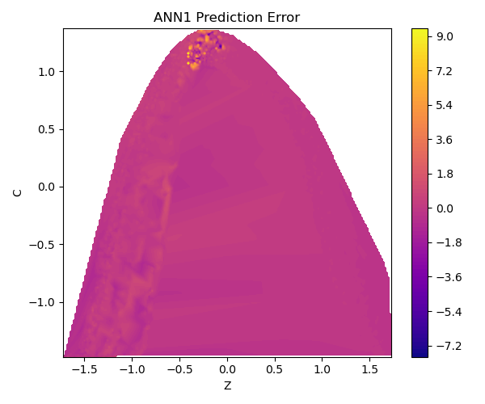 | <ul><li>Errors are mostly close to zero, confirming <strong>low RMSE</strong>.</li><li>Some deviation near high-C regions (tip of domain), likely due to <strong>nonlinearities or data sparsity</strong>.</li><li>No widespread over/under-prediction patterns, showing <strong>stable behavior</strong>.</li></ul> |
| **AAPE Map (Mean Absolute Percentage Error)**<br>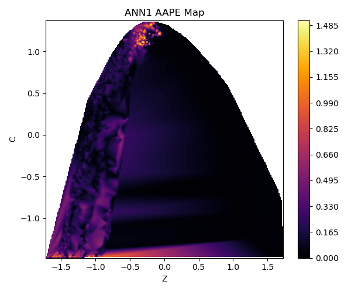 | <ul><li>Majority of the domain has low AAPE (&lt;0.2), indicating <strong>consistently low relative error</strong>.</li><li>High-AAPE spots are concentrated in localized regions, again likely due to <strong>data sparsity or edge complexity</strong>.</li><li>Confirms that ANN1 performs <strong>well in most of the combustion space</strong>, with some edge-case attention needed.</li></ul> |

ANN1 demonstrates strong predictive accuracy and generalization across the combustion space, making it a viable and efficient replacement for traditional table-based methods like Flamelet-Generated Manifolds in combustion simulations.

---

### ANN2: Deep Neural Network

ANN2 is a deeper feedforward network designed to improve learning capacity over ANN1: `Input (5) → Linear(128) → ReLU → Linear(64) → ReLU → Linear(32) → ReLU → Linear(16) → ReLU → Linear(1)`, also trained with MSE loss and Adam over 100 epochs.

**Performance:**
| Split       | RMSE    | R²      | MAAPE   |
|-------------|---------|---------|---------|
| Validation  | 0.8940  | 0.9800  | 0.0704  |
| Test        | 0.8505  | 0.9820  | 0.0699  |

| **Graph**                                  | **Inference**                                                                                                                                                        |
|-------------------------------------------|----------------------------------------------------------------------------------------------------------------------------------------------------------------------|
| **Training Curve**<br>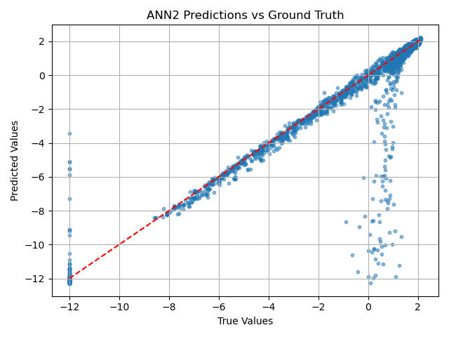 | <ul><li>Points cluster tightly around the 1:1 line, consistent with the high R².</li><li>Slight spread at the most negative targets indicates minor under‑predictions.</li></ul> |
| **Predictions vs Ground Truth**<br> | <ul><li>Points cluster tightly around the 1:1 line, consistent with the high R².</li><li>Slight spread at the most negative targets indicates minor under‑predictions in that extreme range.</li></ul> |
| **True log(ω̇C) Map**<br>         | <ul><li>Displays the characteristic flamelet structure across the Z–C space, serving as the physical reference.</li></ul> |
| **Predicted log(ω̇C) Map**<br>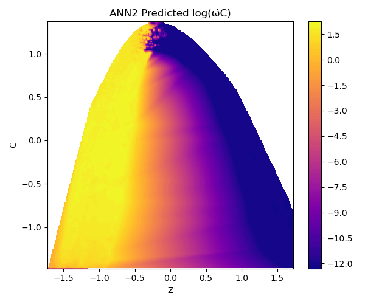 | <ul><li>Successfully reproduces the global pattern of the true field.</li><li>Fine‑scale streaks suggest sensitivity in sparse regions, but dominant gradients are preserved.</li></ul> |
| **Prediction Error Map**<br>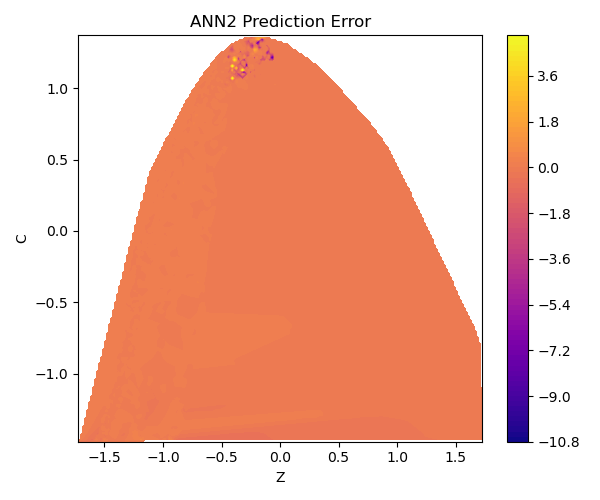 | <ul><li>Errors remain near zero across most of the domain, in line with the low RMSE.</li><li>Localized pockets of higher error near flame tip where data are sparse.</li></ul> |
| **AAPE Map (Mean Absolute Percentage Error)**<br>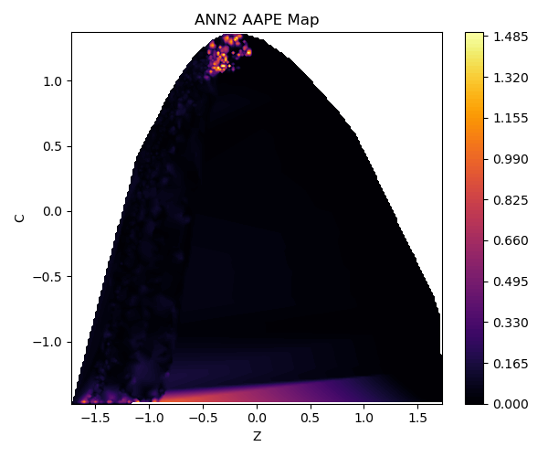 | <ul><li>Most of the domain shows AAPE below 0.1, confirming low relative error.</li><li>Elevated AAPE aligns with high‑gradient regions in the error map.</li></ul> |

---

### RF: Random Forest Regressor

The Random Forest model uses an ensemble of decision trees to predict log(ω̇<sub>C</sub>). It is non-parametric, handles non-linear interactions well, and needs no gradient-based training. Implemented with scikit-learn's `RandomForestRegressor` (100 estimators, fixed seed).

**Performance:**
| Split       | RMSE    | R²      | MAAPE   |
|-------------|---------|---------|---------|
| Validation  | 0.7614  | 0.9853  | 0.0323  |
| Test        | 0.7962  | 0.9842  | 0.0317  |

| **Graph** | **Inference** |
|-----------|---------------|
| **Predictions vs Ground Truth**<br>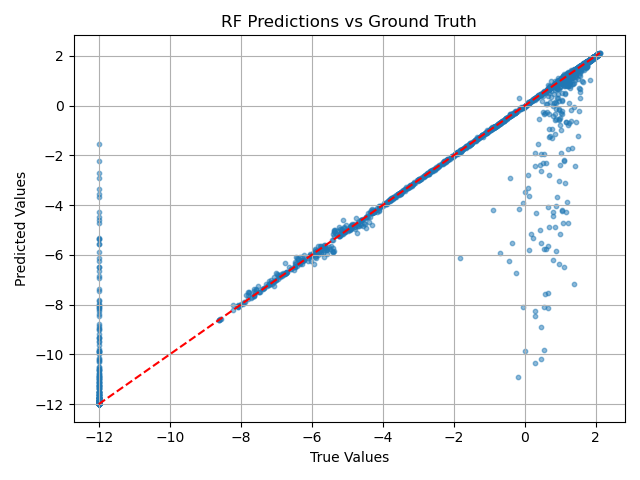 | <ul><li>Predictions align closely with the ideal \( y = x \) line, indicating excellent accuracy.</li><li>Minor deviations occur in extreme value ranges, but the overall distribution shows high fidelity.</li><li>The high R² and low error metrics support strong model reliability.</li></ul> |
| **AAPE Map (Average Absolute Percentage Error)**<br>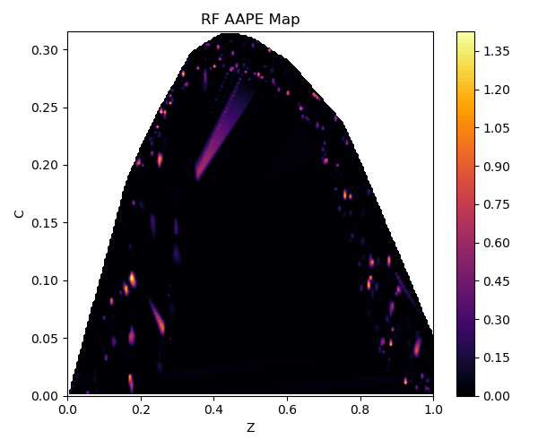 | <ul><li>Most of the Z–C domain exhibits very low percentage error (dark regions).</li><li>Isolated areas with higher AAPE suggest possible extrapolation zones or sparse training coverage.</li><li>Consistency across the bulk of the domain indicates strong generalization.</li></ul> |

---

### GBT: Gradient Boosted Trees

The Gradient Boosted Trees model trains shallow trees sequentially, each correcting the residuals of the previous ones. Implemented with `GradientBoostingRegressor` (300 estimators, learning rate 0.05, max depth 6). Slower to train than RF, but often competitive on structured tabular data.

**Performance:**
| Split       | RMSE    | R²      | MAAPE   |
|-------------|---------|---------|---------|
| Validation  | 0.8637  | 0.9811  | 0.0493  |
| Test        | 0.9047  | 0.9796  | 0.0479  |

| **Graph** | **Inference** |
|-----------|---------------|
| **Predictions vs Ground Truth**<br>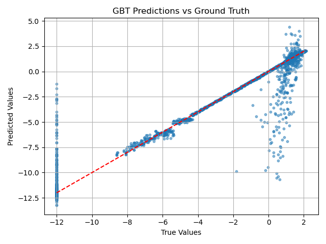 | <ul><li>Most predictions are tightly clustered around the ideal line (in red), confirming generally accurate predictions.</li><li>Slightly more scatter in regions with higher true values compared to ANN2 and RF.</li></ul> |
| **AAPE Map (Average Absolute Percentage Error)**<br>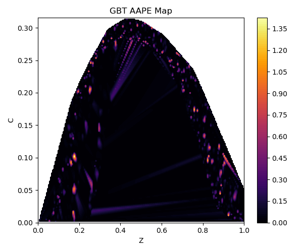 | <ul><li>The AAPE map shows areas of relatively higher errors concentrated at the edges and some sharp streaks across the domain.</li><li>Similar patterns are visible in RF and ANN2, likely due to sparsity or edge effects.</li></ul> |

---

## Overall Model Comparisons

The bar plots below (generated by `model_code/compare.py`) consolidate validation and test scores across RMSE, R², MAAPE, and accuracy (`|Δ| ≤ 0.1`) for all four models.

### Validation Set
| Model | RMSE ↓ | R² ↑ | MAAPE ↓ | Accuracy (\|Δ\| ≤ 0.1) ↑ |
|-------|--------|------|---------|----------------------------|
| ANN1 | 0.8783 | 0.9807 | 0.1215 | 34.21% |
| ANN2 | 0.8940 | 0.9800 | 0.0704 | 36.89% |
| GBT | 0.8637 | 0.9811 | 0.0493 | 87.14% |
| RF | 0.7614 | 0.9853 | 0.0323 | 93.29% |

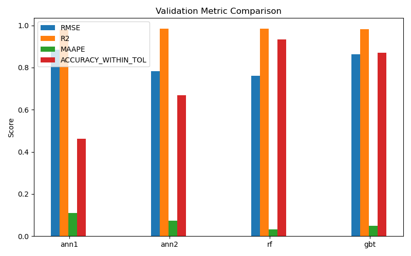

**Inference:**
- **Random Forest** performs best overall: lowest RMSE (0.761) and MAAPE (3.23%), highest R² (0.9853) and accuracy (93.29%) — strong fitting and generalization without deep learning.
- **GBT** is close behind, with very low MAAPE (4.93%) and accuracy over 87%, though a slightly higher RMSE than RF suggests more sensitivity to outliers.
- **ANN2** improves over ANN1 in MAAPE (7.04% vs 12.15%) and accuracy, but both ANNs still lag far behind the tree-based methods in predictive precision.
- **ANN1** has the highest error rates, likely due to underfitting with its shallow architecture.

### Test Set
| Model | RMSE ↓ | R² ↑ | MAAPE ↓ | Accuracy (\|Δ\| ≤ 0.1) ↑ |
|-------|--------|------|---------|----------------------------|
| ANN1 | 0.8978 | 0.9799 | 0.1233 | 33.54% |
| ANN2 | 0.8505 | 0.9820 | 0.0699 | 35.06% |
| GBT | 0.9047 | 0.9796 | 0.0479 | 87.58% |
| RF | 0.7962 | 0.9842 | 0.0317 | 93.25% |

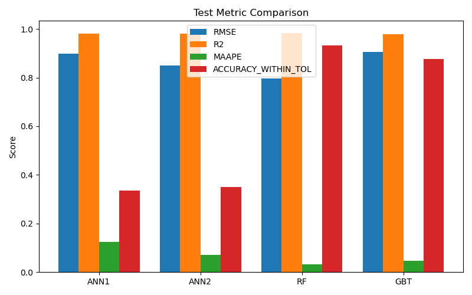

**Inference:**
- Random Forest again outperforms all others, maintaining the lowest RMSE/MAAPE and consistently high accuracy (93.25%).
- GBT generalizes slightly worse than RF but still offers excellent accuracy and MAAPE under 5%.
- ANN2 remains slightly better than ANN1, especially in MAAPE (6.99% vs 12.33%), but both ANN accuracies (~35%) trail the tree-based models by a wide margin.
- The ANN-vs-tree performance gap is consistent across validation and test, highlighting the strength of ensemble methods for this structured, tabular dataset.

---

## Conclusion

Among all models tested, **tree-based ensemble methods (RF and GBT)** clearly outperform the neural networks (ANN1 and ANN2) across every evaluation metric:

- **Random Forest** consistently delivers the **best overall performance** — lowest RMSE and MAAPE, highest tolerance accuracy on both validation and test sets.
- **Gradient Boosted Trees** follow closely, with strong generalization and MAAPE under 5%.
- **ANN2**, despite added depth over ANN1, shows only modest improvement and still trails the tree models in accuracy.
- **ANN1** works as a minimal baseline but underfits the non-linear structure in the flamelet data.

For a structured, low-dimensional combustion dataset like this one, classical ensemble models (RF, GBT) not only outperform deep neural networks — they also train faster and are more interpretable, making them the more practical choice here for surrogate modeling of flamelet manifolds.

---

## Project Structure

```
dataset_generation/   # Cantera flamelet generation + preprocessing into big_dataset.csv
model_code/           # ANN1, ANN2, RF, GBT training scripts + shared data/eval/plot utilities
data/processed/       # big_dataset.csv (data/raw/ is git-ignored — regenerate via Cantera)
results/graph/        # Metrics (JSON), raw predictions (.npz), and all plots per model
environment.yml        # Conda environment (Cantera, PyTorch, scikit-learn)
```
