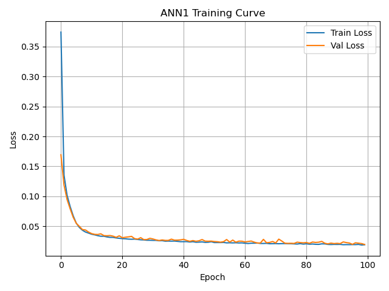
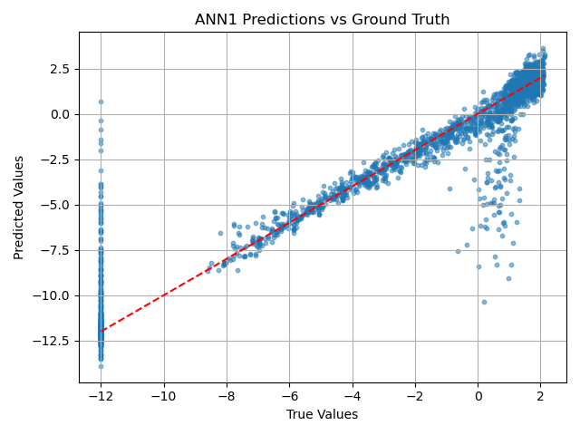
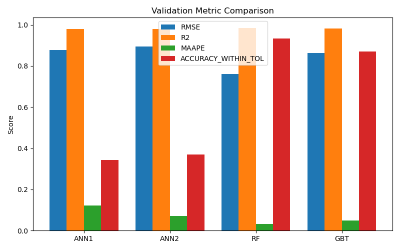

# 🔥 Flamelet-Based Combustion Modeling using Machine Learning
## 📘 Introduction

This project aims to replace traditional combustion table lookups (like Flamelet-Generated Manifolds) with accurate and efficient machine learning models. The goal is to predict the **source term of the progress variable (ω̇<sub>C</sub>)** using various ML regressors trained on preprocessed flamelet data. This can significantly reduce computational cost in combustion simulations without compromising accuracy.

We explore and compare multiple regression models:
- Feedforward Neural Networks (ANN1 & ANN2)
- Random Forest (RF)
- Gradient Boosted Trees (GBT)

All models are evaluated against key performance metrics and visualized across the Z–C combustion space.

---

## ⚙️ How the Project Works
### 1. Environment Setup

A dedicated `conda` environment is used to ensure compatibility across Cantera, PyTorch, and supporting libraries.
Run the following commands to set up the environment:
```bash
    conda env create -f environment.yml
    conda activate ml-fgm-env
```

### 2. Generating Flamelet Data
This step involves generating synthetic flamelet data using Cantera, which serves as the training dataset for our ML models. The script `generate_flamelet_data.py` handles this process.
**a) Create a single flamelet dataset:****

```bash
    python3 dataset_generation/generate_flamelets.py
```
This will generate a single flamelet dataset in the `data/raw` directory.
To Preprocess the data, run:
```bash
    python3 dataset_generation/preprocess_data.py
```

**b) Create a batch of 200 flamelet datasets(will take time):**
```bash
    python3 dataset_generation/generate_flamelet_batch.py
```
This will generate a batch of 200 flamelet datasets in the `data/raw` directory. To preprocess the data, run:
```bash
    python3 dataset_generation/preprocess_data_batch.py
```

**This will create `big_dataset.csv` in the `data/processed` directory.**

### 3. Training Machine Learning Models
Each model is trained using its own script. You can run them independently:
```bash
    python3 model_code/ann1.py   # Small ANN
    python3 model_code/ann2.py   # Deeper ANN
    python3 model_code/rf.py     # Random Forest
    python3 model_code/gbt.py    # Gradient Boosted Trees
```

### 4. Visualize Model Performance
You can generate different visualizations using these scripts:
- **ANN-Specific Visualizations:**
```bash
    python3 model_code/ann_plots.py
```

- **RF + GBT Visualizations:**
```bash
    python3 model_code/tree_plots.py
```

- **Overall metric comparison (load-only, no retraining):**
```bash
    python3 model_code/main.py
```
**It will save all the resulting plots in the `results/graph` directory.**

---

## 📊 Results
**Let us now analyze the results of our models:**
### 🔧 ANN1: Baseline Neural Network

ANN1 is a lightweight feedforward neural network designed to serve as a baseline model for predicting the log-transformed source term of the progress variable (log ω̇<sub>C</sub>). It consists of three fully connected layers with ReLU activations:

- **Input:** 5 features — Z, C, T<sub>inlet</sub>, Pressure, and ṁ
- **Architecture:**  
  `Input (5) → Linear(64) → ReLU → Linear(32) → ReLU → Linear(1)`
- **Output:** log(ω̇<sub>C</sub>)

The model is trained using Mean Squared Error (MSE) loss and the Adam optimizer over 100 epochs. Due to its compact size, ANN1 is fast to train and ideal for evaluating general trends in the dataset.

**Performance:**
| Split       | RMSE    | R²      | MAAPE   |
|-------------|---------|---------|---------|
| Validation  | 0.8783  | 0.9807  | 0.1215  |
| Test        | 0.8978  | 0.9799  | 0.1233  |

<!-- **Training Curve**  


- **Inference:**
  - Training and validation losses decrease rapidly and stabilize by ~30 epochs.
  - Both curves track closely, suggesting **no overfitting**.
  - Final loss values are very low, confirming **effective learning and generalization**.


**Predictions vs Ground Truth**  


- Inference
  - Strong alignment along the diagonal line indicates **high prediction accuracy**.
  - Most values tightly cluster around the ideal line, confirming **strong R² (≈0.98)**.
  - Slight deviation at extreme values (e.g., low end saturation) points to **minor edge-case errors**.

**True log(ω̇C) Map**  


- Inference:
  - Smooth and physically plausible distribution over the Z–C domain.
  - Clearly reveals regions of high and low \( \dot{\omega}_C \), providing a **solid reference for model predictions**.

**Predicted log(ω̇C) Map**  


- Inference:
  - Accurately captures overall structure seen in the true map.
  - Smooth gradients imply **good generalization** over continuous space.
  - Minor sharp features may reflect **limited learning near sparse or steep regions**.

**Prediction Error Map**  


- Inference:
  - Errors are mostly close to zero, confirming **low RMSE**.
  - Some deviation near high-C regions (tip of domain), likely due to **nonlinearities or data sparsity**.
  - No widespread over/under-prediction patterns, showing **stable behavior**.

**AAPE Map (Mean Absolute Percentage Error)**  


- Inference:
  - Majority of the domain has low AAPE (<0.2), indicating **consistently low relative error**.
  - High-AAPE spots are concentrated in localized regions, again likely due to **data sparsity or edge complexity**.
  - Confirms that ANN1 performs **well in most of the combustion space**, with some edge-case attention needed. -->

| **Graph** | **Inference** |
|-----------|---------------|
| **Training Curve**<br> | <ul><li>Training and validation losses decrease rapidly and stabilize by ~30 epochs.</li><li>Both curves track closely, suggesting <strong>no overfitting</strong>.</li><li>Final loss values are very low, confirming <strong>effective learning and generalization</strong>.</li></ul> |
| **Predictions vs Ground Truth**<br> | <ul><li>Strong alignment along the diagonal line indicates <strong>high prediction accuracy</strong>.</li><li>Most values tightly cluster around the ideal line, confirming <strong>strong R² (≈0.98)</strong>.</li><li>Slight deviation at extreme values (e.g., low end saturation) points to <strong>minor edge-case errors</strong>.</li></ul> |
| **True log(ω̇C) Map**<br> | <ul><li>Smooth and physically plausible distribution over the Z–C domain.</li><li>Clearly reveals regions of high and low \( \dot{\omega}_C \), providing a <strong>solid reference for model predictions</strong>.</li></ul> |
| **Predicted log(ω̇C) Map**<br> | <ul><li>Accurately captures overall structure seen in the true map.</li><li>Smooth gradients imply <strong>good generalization</strong> over continuous space.</li><li>Minor sharp features may reflect <strong>limited learning near sparse or steep regions</strong>.</li></ul> |
| **Prediction Error Map**<br> | <ul><li>Errors are mostly close to zero, confirming <strong>low RMSE</strong>.</li><li>Some deviation near high-C regions (tip of domain), likely due to <strong>nonlinearities or data sparsity</strong>.</li><li>No widespread over/under-prediction patterns, showing <strong>stable behavior</strong>.</li></ul> |
| **AAPE Map (Mean Absolute Percentage Error)**<br> | <ul><li>Majority of the domain has low AAPE (&lt;0.2), indicating <strong>consistently low relative error</strong>.</li><li>High-AAPE spots are concentrated in localized regions, again likely due to <strong>data sparsity or edge complexity</strong>.</li><li>Confirms that ANN1 performs <strong>well in most of the combustion space</strong>, with some edge-case attention needed.</li></ul> |


ANN1 demonstrates strong predictive accuracy and generalization across the combustion space, making it a viable and efficient replacement for traditional table-based methods like Flamelet-Generated Manifolds in combustion simulations.

---

### 🔧 ANN2: Deep Neural Network

ANN2 is a deeper feedforward neural network architecture, designed to improve learning capacity over ANN1. It uses additional hidden layers and a larger number of neurons to better capture the non-linearities in the flamelet dataset.

- **Input:** 5 features — Z, C, T<sub>inlet</sub>, Pressure, and ṁ
- **Architecture:**  
  `Input (5) → Linear(128) → ReLU → Linear(64) → ReLU → Linear(32) → ReLU → Linear(16) → ReLU → Linear(1)`
- **Output:** log(ω̇<sub>C</sub>)

This model is trained using MSE loss and the Adam optimizer, for 100 epochs. The increased depth and width allow ANN2 to achieve slightly better generalization compared to ANN1.
<br>
**Performance:**

| Split       | RMSE    | R²      | MAAPE   |
|-------------|---------|---------|---------|
| Validation  | 0.8940  | 0.9800  | 0.0704  | 
| Test        | 0.8505  | 0.9820  | 0.0699  | 

<!-- **Training Curve**  


- Inference:  
  - Points cluster tightly around the 1:1 line, consistent with the high R².  
  - Slight spread at the most negative targets indicates minor under‑predictions in that extreme range.  

**True log(ω̇C) Map**  


- Inference:  
  - Displays the characteristic flamelet structure across the Z–C space, serving as the physical reference.  

**Predicted log(ω̇C) Map**  


- Inference:  
  - Successfully reproduces the global pattern of the true field.  
  - Fine‑scale streaks suggest some sensitivity in sparsely sampled regions, but the dominant gradients are preserved.  

**Prediction Error Map**  


- Inference:  
  - Errors remain near zero across most of the domain, in line with the low RMSE.  
  - Localized pockets of higher error emerge near the flame tip where data are scarce and gradients steep.  

**AAPE Map (Mean Absolute Percentage Error)**  


- Inference:  
  - The bulk of the domain shows AAPE below 0.1, confirming low relative error.  
  - Elevated AAPE aligns with the high‑gradient regions highlighted in the error map.  

Conclusion: ANN2 retains the strong predictive power of ANN1 while trimming validation and test errors slightly, reinforcing its suitability for modeling \( \dot{\omega}_C \) across the flamelet manifold. -->

| **Graph**                                  | **Inference**                                                                                                                                                        |
|-------------------------------------------|----------------------------------------------------------------------------------------------------------------------------------------------------------------------|
| **Training Curve**<br> | <ul><li>Points cluster tightly around the 1:1 line, consistent with the high R².</li><li>Slight spread at the most negative targets indicates minor under‑predictions.</li></ul> |
| **Predictions vs Ground Truth**<br> | <ul><li>Points cluster tightly around the 1:1 line, consistent with the high R².</li><li>Slight spread at the most negative targets indicates minor under‑predictions in that extreme range.</li></ul> |
| **True log(ω̇C) Map**<br>         | <ul><li>Displays the characteristic flamelet structure across the Z–C space, serving as the physical reference.</li></ul> |
| **Predicted log(ω̇C) Map**<br> | <ul><li>Successfully reproduces the global pattern of the true field.</li><li>Fine‑scale streaks suggest sensitivity in sparse regions, but dominant gradients are preserved.</li></ul> |
| **Prediction Error Map**<br> | <ul><li>Errors remain near zero across most of the domain, in line with the low RMSE.</li><li>Localized pockets of higher error near flame tip where data are sparse.</li></ul> |
| **AAPE Map (Mean Absolute Percentage Error)**<br> | <ul><li>Most of the domain shows AAPE below 0.1, confirming low relative error.</li><li>Elevated AAPE aligns with high‑gradient regions in the error map.</li></ul> |

### 🌲 RF: Random Forest Regressor

The Random Forest model uses an ensemble of decision trees to predict the source term log(ω̇<sub>C</sub>). It is non-parametric, handles non-linear interactions well, and requires minimal preprocessing. In this project, the RF model was trained using scikit-learn’s `RandomForestRegressor` with 100 estimators and a fixed random seed for reproducibility.

Unlike neural networks, RF does not require feature scaling or backpropagation. It achieves strong performance due to its ability to model complex interactions and average across trees to reduce variance.
<br>
**Performance:**
| Split       | RMSE    | R²      | MAAPE   |
|-------------|---------|---------|---------|
| Validation  | 0.7614  | 0.9853  | 0.0323  |
| Test        | 0.7962  | 0.9842  | 0.0317  |

<!-- **Predictions vs Ground Truth**  


- **Inference:**
  - Predictions align closely with the ideal \( y = x \) line, indicating excellent accuracy.
  - Minor deviations occur in extreme value ranges, but the overall distribution shows high fidelity.
  - The high R² and low error metrics support strong model reliability.

**AAPE Map (Average Absolute Percentage Error)**  


- **Inference:**
  - Most of the Z–C domain exhibits very low percentage error (dark regions).
  - Isolated areas with higher AAPE suggest possible extrapolation zones or sparse training coverage.
  - Consistency across the bulk of the domain indicates strong generalization. -->
  | **Graph** | **Inference** |
|-----------|---------------|
| **Predictions vs Ground Truth**<br> | <ul><li>Predictions align closely with the ideal \( y = x \) line, indicating excellent accuracy.</li><li>Minor deviations occur in extreme value ranges, but the overall distribution shows high fidelity.</li><li>The high R² and low error metrics support strong model reliability.</li></ul> |
| **AAPE Map (Average Absolute Percentage Error)**<br> | <ul><li>Most of the Z–C domain exhibits very low percentage error (dark regions).</li><li>Isolated areas with higher AAPE suggest possible extrapolation zones or sparse training coverage.</li><li>Consistency across the bulk of the domain indicates strong generalization.</li></ul> |


### 📈 GBT: Gradient Boosted Trees

The Gradient Boosted Trees model uses an ensemble of shallow trees trained sequentially, where each new tree corrects the residuals of the previous ones. GBT is particularly effective in capturing complex non-linear relationships with high accuracy and low bias.

This model was implemented using `GradientBoostingRegressor` from scikit-learn with 300 estimators, learning rate of 0.05, and a fixed depth. While GBTs typically train slower than RFs, they often outperform in terms of generalization on structured tabular data.
<br>
**Performance:**

| Split       | RMSE    | R²      | MAAPE   |
|-------------|---------|---------|---------|
| Validation  | 0.8637  | 0.9811  | 0.0493  |
| Test        | 0.9047  | 0.9796  | 0.0479  |

<!-- **Predictions vs Ground Truth**  


- **Inference:**
    - Most predictions are tightly clustered around the ideal line (in red), confirming generally accurate predictions.
    - Slightly more scatter in regions with higher true values compared to ANN2 and RF.

**AAPE Map (Average Absolute Percentage Error)**  


- **Inference:**
    - The AAPE (Average Absolute Percentage Error) map shows areas of relatively higher errors concentrated at the edges and some sharp streaks across the domain.
    - Similar patterns are visible in RF and ANN2, likely due to sparsity or edge effects. -->

| **Graph** | **Inference** |
|-----------|---------------|
| **Predictions vs Ground Truth**<br> | <ul><li>Most predictions are tightly clustered around the ideal line (in red), confirming generally accurate predictions.</li><li>Slightly more scatter in regions with higher true values compared to ANN2 and RF.</li></ul> |
| **AAPE Map (Average Absolute Percentage Error)**<br> | <ul><li>The AAPE map shows areas of relatively higher errors concentrated at the edges and some sharp streaks across the domain.</li><li>Similar patterns are visible in RF and ANN2, likely due to sparsity or edge effects.</li></ul> |

---

## 📊 Overall Model Comparisons
After independently analyzing the performance of each model, we now summarize their relative strengths across all four metrics. The goal here is not just to highlight raw accuracy, but to understand trade-offs in complexity, generalization, and spatial behavior.

The bar plots below consolidate validation and test scores across RMSE, R², MAAPE, and accuracy (\\|Δ\\| ≤ 0.1), while accompanying heatmaps give insight into how errors are distributed across the Z–C domain.

### 📈 Validation Set Observations
| Model | RMSE ↓ | R² ↑ | MAAPE ↓ | Accuracy (\|Δ\| ≤ 0.1) ↑ |
|-------|--------|------|---------|----------------------------|
| ANN1 | 0.8783 | 0.9807 | 0.1215 | 34.21% |
| ANN2 | 0.8940 | 0.9800 | 0.0704 | 36.89% |
| GBT | 0.8637 | 0.9811 | 0.0493 | 87.14% |
| RF | 0.7614 | 0.9853 | 0.0323 | 93.29% |


**Inference:**
- Random Forest (RF) performs the best overall across all metrics. It has:

  - The lowest RMSE (0.761) and MAAPE (3.23%)

  - Highest R² (0.9853) and accuracy (93.29%)

  - Indicates strong fitting and generalization even without deep learning

- Gradient Boosted Trees (GBT) also show excellent results, especially:

  - Very low MAAPE (4.93%)

  - Accuracy over 87% within tolerance

  - Slightly higher RMSE than RF, suggesting a bit more sensitivity to outliers

- ANN2 improves over ANN1 in MAAPE (7.04%) vs (12.15%) and accuracy, but both still lag far behind tree-based methods in predictive precision

- ANN1 has the highest error rates, likely due to underfitting with a shallow architecture

### 📈 Test Set Observations
| Model | RMSE ↓ | R² ↑ | MAAPE ↓ | Accuracy (\|Δ\| ≤ 0.1) ↑ |
|-------|--------|------|---------|----------------------------|
| ANN1 | 0.8978 | 0.9799 | 0.1233 | 33.54% |
| ANN2 | 0.8505 | 0.9820 | 0.0699 | 35.06% |
| GBT | 0.9047 | 0.9796 | 0.0479 | 87.58% |
| RF | 0.7962 | 0.9842 | 0.0317 | 93.25% |


**Inference:**
- Random Forest again outperforms all others:

  - Maintains lowest RMSE and MAAPE

  - Delivers consistently high accuracy (93.25%), showing strong generalization

- GBT generalizes slightly worse than RF but still offers excellent accuracy and smooth predictions, with MAAPE under 5%

- ANN2 remains slightly better than ANN1, especially in MAAPE (6.99% vs 12.33%), but their accuracies (35%) are significantly lower than tree-based models

- The performance gap between ANNs and trees is consistent across validation and test, highlighting the strength of ensemble models for this kind of structured data

---

## ✅ Conclusion

Among all models tested, **tree-based ensemble methods (RF and GBT)** clearly outperform the neural network models (ANN1 and ANN2) across every evaluation metric. In particular:

- **Random Forest** consistently delivers the **best overall performance**, with the lowest RMSE and MAAPE, and the highest accuracy within tolerance on both validation and test sets.
- **Gradient Boosted Trees** closely follow, achieving very competitive results and demonstrating strong generalization capabilities.
- **ANN2**, despite having a deeper architecture than ANN1, shows only modest improvements and still lags significantly behind the tree models in predictive accuracy.
- **ANN1** serves well as a minimal baseline, but its limited capacity makes it less effective for capturing the complex behavior in flamelet-generated data.

In conclusion, **for structured combustion datasets like this one, classical ensemble models like RF and GBT not only outperform deep neural networks, but do so with faster training times and greater interpretability** — making them highly practical choices for surrogate modeling of flamelet manifolds.
